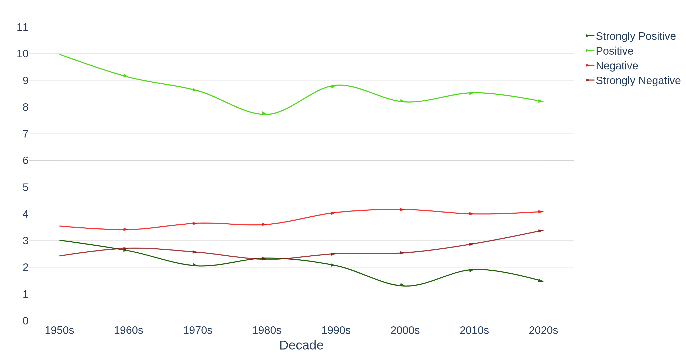

# Portfolio

---

## Newsletter

### #5 A study on the most offensive teams in Europe

Football coaches are known for making bold statements about their teams. Still, when FC Barcelona coach Xavi Hernandez recently boasted that his team is the most offensive team in Europe along with Manchester City, it raised some eyebrows (even Ancelotti’s unsurprisingly). In this article, I will explore the validity of this claim by analyzing data from the teams in the five big European football leagues: La Liga, Premier League, Serie A, Bundesliga, and Ligue 1

{:target="_blank"} {:target="_blank"}

{:target="_blank"}

---

### #4 What it takes to win at the PGA Tour

In this article, I will be exploring PGA Tour Data from 2015-2022 focusing on ‘strokes gained’ metrics to analyze what it takes to succeed in the most competitive golf tour on the planet.

{:target="_blank"} {:target="_blank"}

{:target="_blank"}

---

### #3 Evolution of song lyrics since the 50s

Is music really that different from back in the day? In my last article, I explored how countries like different music styles based on their Spotify Hitlists. In this article, I will take a look at the past and analyze how music has evolved since the fifties through a sentiment and a topic analysis.

{:target="_blank"}  {:target="_blank"}

{:target="_blank"}

---

### #2 What the top 100 Spotify hits tell us about a countries' musical taste

Is it true that Spain only listens to flamenco? Do Germans even listen to music? What is Mexican music like? A lot of stereotypes exist about the different countries, in this article, I will explore countries’ musical tastes based on their Spotify hit lists.

{:target="_blank"}    {:target="_blank"}

{:target="_blank"}

---

### #1 High-pressure points in Tennis and The Big 3

In this episode, I will explore the performance of TB3 versus its peers in the ATP Tour during HPP. I explore a dataset containing data of 1’202’769 tennis points played in the Grand Slams from 2012-2019,1 arguably the time when all three players were playing at their best level.

{:target="_blank"}  {:target="_blank"}

{:target="_blank"}

---

## Other

### Predict Breast Cancer with RF, PCA and SVM using Python

In this project I am going to perform comprehensive EDA on the breast cancer dataset, then transform the data using Principal Components Analysis (PCA) and use Support Vector Machine (SVM) model to predict whether a patient has breast cancer.

{:target="_blank"}

{:target="_blank"}

### Predict if Booking will be canceled or not

In this project I am going to perform Data Exploratio, Data Preprocessing & Feature Engineering and train Different models optimizing the hyper-parameters to predict wether a reservation will be canceled or not

.ipynb){:target="_blank"}

.ipynb){:target="_blank"}
